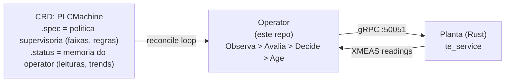

# 01 — Visao geral

## O que e esse repo?

Esse e o **operator Kubernetes** que atua como controlador supervisorio da planta TEP (Tennessee Eastman Process). O nome `tep-operator` vem da analogia com os providers do Cluster API — assim como o CAPA provisiona maquinas na AWS, esse provider supervisiona controladores numa planta industrial via gRPC.

A planta vive sozinha — tem controladores PID ja rodando e sofre disturbios aleatorios. O operator nao empurra configuracao. Ele **observa** as variaveis medidas (XMEAS) via gRPC, **avalia** se estao dentro de faixas aceitaveis, **decide** se precisa intervir, e **age** ajustando parametros dos controladores existentes. Se a planta esta estavel, nao faz nada.

## Onde esse repo se encaixa

O lab tem 4 repositorios:

```
spec-tennessee-eastman       <- issues, specs, decisoes de arquitetura
tep-plant        <- a planta (Rust) + gRPC server
tep-operator     <- ESTE REPO: o operator K8s (Go)
tep-supervisor           <- infra do cluster (Kind, manifests de deploy)
```

O fluxo e:



## Tecnologia

- **Go 1.25+** com **Kubebuilder 4.12** (controller-runtime v0.23)
- API group: `infrastructure.greenlabs.io/v1alpha1`
- CRD unica: `PLCMachine`
- Comunicacao com a planta: **gRPC** (proto definido no repo `tep-plant`)

## O que ja esta pronto

| O que                        | Status         |
|------------------------------|----------------|
| Scaffold do Kubebuilder      | Completo       |
| CRD PLCMachine (types)       | Redesenhada (supervisoria) |
| Reconciler                   | Stub (vazio)   |
| RBAC, Kustomize, Deployment  | Auto-gerado    |
| Dockerfile do operator       | Pronto         |
| Testes unitarios             | Template       |
| Testes E2E                   | Template       |

## Proximo passo

Implementar o reconciler (issue #38) — o loop supervisorio que conecta via gRPC na planta, le XMEAS, avalia faixas, e decide se precisa ajustar parametros.
